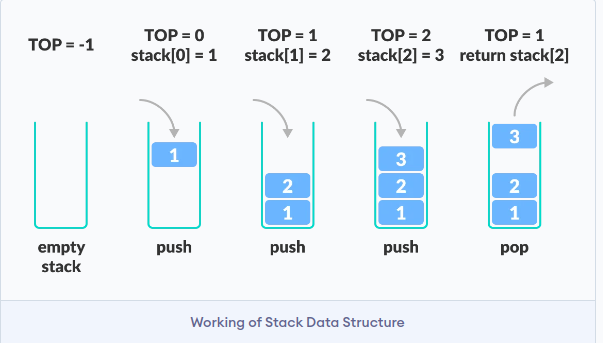

# STACK
A stack is a collection of data in which you can only add a piece of data at the top of the structure or retrieve a piece of data from the top.

### LAST IN, FIRST OUT
## Operations performed by Stack

> Stack can be implemented using one pointer.
> The pointer points to the current element added.

* push: add element to the top of a stack
* pop: remove element from the top of a stack
* isEmpty: check if stack is empty
* isFull: check if stack is full
* Peek: Get the value of the top element without removing it.

### Working of Stack Data Structure

1. A pointer called `TOP` is used to keep track of the top element in the stack.
2. When initializing the stack, we set its value to -1 so that we can check if the stack is empty by comparing `TOP == -1`
3. On pushing an element, we increase the value of `TOP` and place the new element in the position pointed by the `TOP
4. On popping an element, we return the element pointed to by `TOP` and reduce its value.
5. Before pushing, we check if the stack is already full.
6. Before popping, we check if the stack is already empty.

## Time Complexity
The push and pop operations of stack has a time complexity of O(1)

## APPLICATION OF STACK DATA STRUCTURE
1. To reverse a word: Put all the letters in a stack and pop them out. Because of the LIFO order of stack, you will get the lettter in reverse order.
2. In compilers: compilers use the stack to calculate the value of expression like `2 + 4 / 5 * (7 - 9)` by converting the expression to prefix or postfix form.
3. In browsers: The back button in a browser saves all the URLs you have visited previously in a stack. Each time you visit a new page, it is added on top of the stack. When you press the back button, the current URLs is removed from the stack, and the previous URL is access.

## Features of stacks
1. Dynamic data structure
2. Do not have a fixed size.
3. Do not consume a fixed amount of memory.
4. Size of stack changes with each push() and pop() operation.

# QUEUE

### FIRST IN, FIRST OUT

> Can be implemented using two pointers. First pointer at 1st index, 2nd pointer at the next of the last index.
> If queue is empty, two pointers = 0.
> It stores n-1 elements in an array.

### Operations in Queue

* Dequeue: removing element from queue
* Dequeue: adding element to queue.

* Assuming the number of element does not exceed (n-1), then the time complexity of dequeue and queue is O(1).

## DEQUUE / DOUBLE-ENDED QUEUE

> You can add or remove element from either end of the queue.

### Functions Include:
* addLeft or popLeft
* *removeLeft
* addRight
* removeRight

