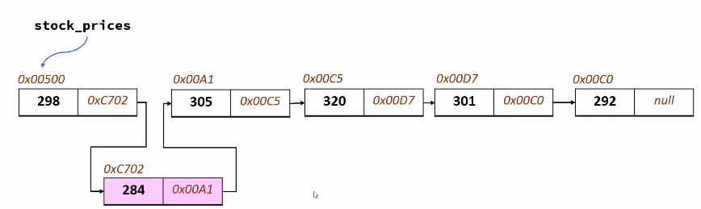
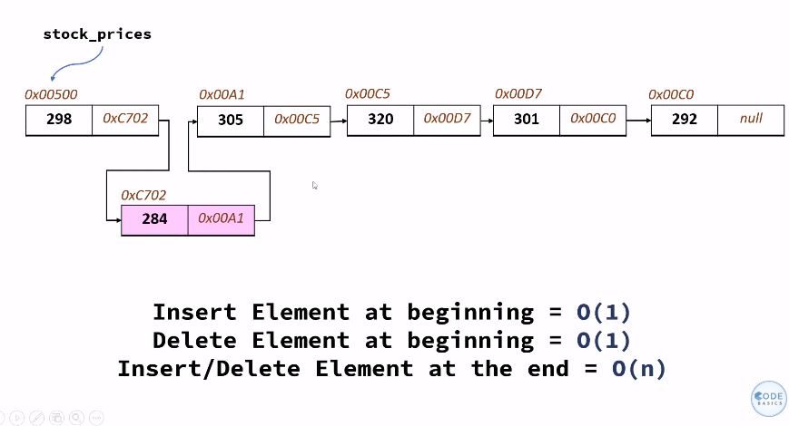
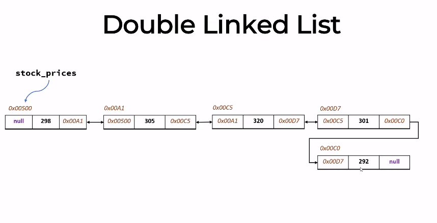

## BIG O NOTATION
Big O notation is used to measure how running time or space requirements for your program grows as input size grows.

### Constant Time

### Quadratic 

### Time and Space Complexities

Binary Search => O(log n)

