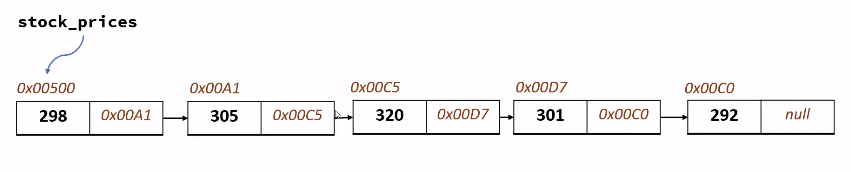

## BIG O NOTATION
Big O notation is used to measure how running time or space requirements for your program grows as input size grows.


### Constant Time


### Quadratic 


### Time and Space Complexities


* Binary Search => O(log n)

4 Bytes is used to store numbers in the computer.


The time complexity of looking up an item by index
is O(1)
* Lookup by index = O(1)

Printing all prices in a list:
* Array traversal = O(n)


* Array insertion = O(n)

* Array deletion = O(n)

### STATIC AND DYNAMIC ARRAYS IN JAVA


When dynamic arrays grows (10), they duplicate the memory capacity
and adds additional capacity of 10*2 = 20.
* Dynamic arrays work by Geometric progression.


# Exercise: Array DataStructure

1. Let us say your expense for every month are listed below,
	1. January -  2200
 	2. February - 2350
    3. March - 2600
    4. April - 2130
    5. May - 2190

Create a list to store these monthly expenses and using that find out,

    1. In Feb, how many dollars you spent extra compare to January?
    2. Find out your total expense in first quarter (first three months) of the year.
    3. Find out if you spent exactly 2000 dollars in any month
    4. June month just finished and your expense is 1980 dollar. Add this item to our monthly expense list
    5. You returned an item that you bought in a month of April and
    got a refund of 200$. Make a correction to your monthly expense list
    based on this

[Solution](https://github.com/codebasics/data-structures-algorithms-python/blob/master/data_structures/2_Arrays/Solution/1_expenses.py)

2. You have a list of your favourite marvel super heros.
```
heros=['spider man','thor','hulk','iron man','captain america']
```

Using this find out,

    1. Length of the list
    2. Add 'black panther' at the end of this list
    3. You realize that you need to add 'black panther' after 'hulk',
       so remove it from the list first and then add it after 'hulk'
    4. Now you don't like thor and hulk because they get angry easily :)
       So you want to remove thor and hulk from list and replace them with doctor strange (because he is cool).
       Do that with one line of code.
    5. Sort the heros list in alphabetical order (Hint. Use dir() functions to list down all functions available in list)

[Solution](https://github.com/codebasics/data-structures-algorithms-python/blob/master/data_structures/2_Arrays/Solution/2_marvel.py)


3. Create a list of all odd numbers between 1 and a max number.
Max number is something you need to take from a user using input() function

[Solution](https://github.com/codebasics/data-structures-algorithms-python/blob/master/data_structures/2_Arrays/Solution/3_odd_even_numbers.py)

## LINKEDLIST

### Insertion in Li nkedList


### TIME COMPLEXITIES OF LINKEDLIST
* Insert Element at beginning  = O(1)
* Delete Element at beginning = O(1)
* Insert / Delete Element at the end = O(n)

PROS OF LINKEDLIST
* You don't need to pre-allocated space.
* Insertion is easier.
* Linked List Traversal = O(n)
* Accessing Element by Value  = O(n)

## DOUBLE LINKED LIST

Has memory address to both previous and next
element.


Indexing in List = list[item]
That makes it O(1)
But with the LinkedList, you need to go through all the 
elements.

With Array, in order to insert an element, 
you need to copy the entire list and add the new element, that 
makes it O(n).
While with linkedList, you only need to reference the new element.

* Time complexity is how the run time grows as the input size grows.

Complexity Analysis - Big O -> how runtime of an algorithm grows as input grous.

### Meaning of O(n)
As the input size increases, the time taken increases.
The number of operations grow proportionally with n.


